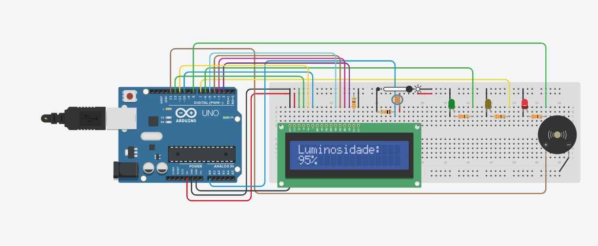

# 📊 Data Logger com Arduino – Luminosidade em Edge Computing  

## 📷 Montagem no Tinkercad

  
  

---

## 📘 Contexto Acadêmico
Este projeto foi desenvolvido como parte da **matéria de Edge Computing**, com o objetivo de aplicar conceitos de coleta, processamento e análise de dados diretamente em dispositivos embarcados, reduzindo a dependência de processamento em nuvem.

---

## 🔎 Sobre o Projeto  
Este projeto em **C++ para Arduino** implementa um sistema de **coleta e exibição de dados de luminosidade** utilizando:  

- 📡 **Fotoresistor (LDR)** – para captar a intensidade da luz ambiente.  
- 💡 **LEDs (verde, amarelo e vermelho)** – indicam níveis de luminosidade.  
- 🔔 **Buzzer** – fornece alertas sonoros conforme a intensidade da luz.  
- 📺 **Display LCD 16x2** – exibe em tempo real os valores de luminosidade em percentual.  

O sistema funciona como um **data logger**, armazenando leituras periódicas e exibindo a média a cada ciclo. Além disso, segue a lógica de **Edge Computing**, processando os dados diretamente no dispositivo antes de qualquer envio ou análise externa.  

---
## 🎞️ Animação no LCD – Logo da Vinheria Agnello

Para tornar o projeto mais imersivo e visualmente atrativo, foi desenvolvida uma *animação personalizada no display LCD 16x2, simulando o **nome da equipe: APAP Systems* na inicialização do sistema.

A animação é construída a partir de *caracteres customizados* criados com a função lcd.createChar().  
Como o LCD suporta apenas *8 caracteres personalizados*, cada letra do logotipo é dividida em partes (superior/inferior, esquerda/direita), permitindo formar letras grandes no display.

O texto se desloca da *direita para a esquerda, criando um efeito de movimento que representa a entrada do nome da equipe — **“APAP”**, a abreviacao de "APAP Systems – “Adaptive Photometric Alarm Platform" ao iniciar o sistema.
---

## ⚙️ Funcionamento  
1. O **LDR** realiza a leitura da luminosidade (0–1023).  
2. A cada **10 leituras**, o Arduino calcula a média.  
3. Essa média é **mapeada para escala percentual invertida** (100% = mais claro, 0% = escuro).  
4. Dependendo do valor, o sistema aciona LEDs e o buzzer:  
   - 🔴 **> 80%** → LED vermelho + buzzer forte.  
   - 🟡 **60–80%** → LED amarelo + buzzer fraco.  
   - 🟢 **< 60%** → LED verde + sem som.  
5. O valor é exibido no **LCD** e enviado via **Serial Monitor**.  

---

## 🛠️ Componentes Utilizados  
- 1x Arduino UNO  
- 1x Protoboard  
- 1x LDR (fotoresistor)  
- 1x Resistor de 10kΩ (para o LDR)  
- 3x LEDs (verde, amarelo, vermelho)  
- 3x Resistores de 220Ω (para os LEDs)  
- 1x Buzzer piezoelétrico  
- 1x Display LCD 16x2 (com interface paralela)  
- Jumpers  

---

## 👥 Integrantes  

| Nome completo               | Função        |
|-----------------------------|---------------|
| Felipe Silva Santos Menezes | Desenvolvedor |
| Gabriel Ardito Manes        | Desenvolvedor |
| João Antonio Sarracine      | Desenvolvedor |
| João Pedro Gonzales         | Desenvolvedor |
